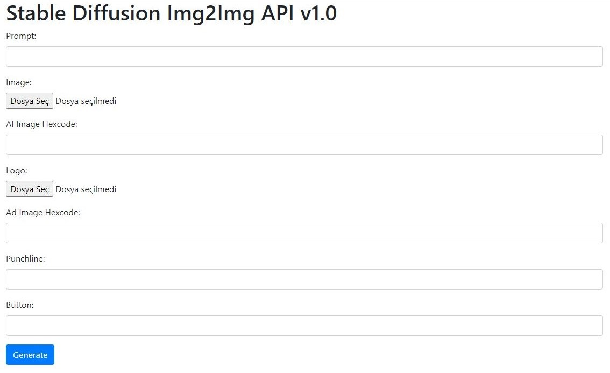
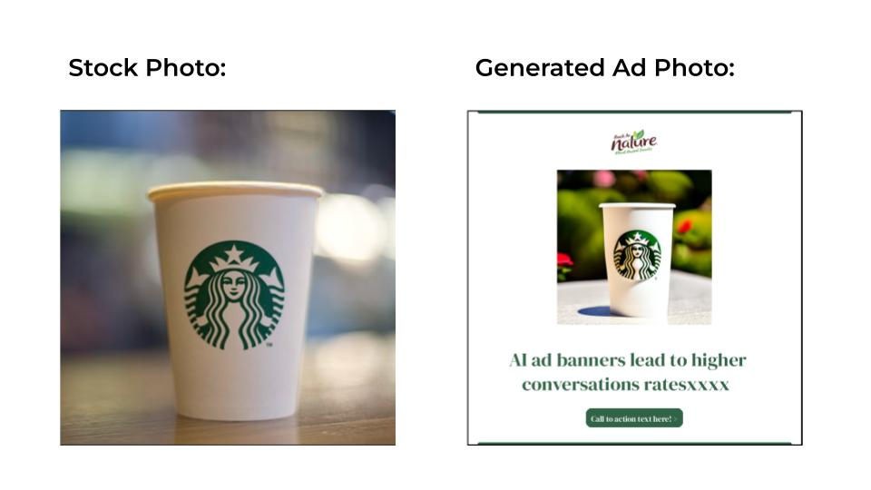
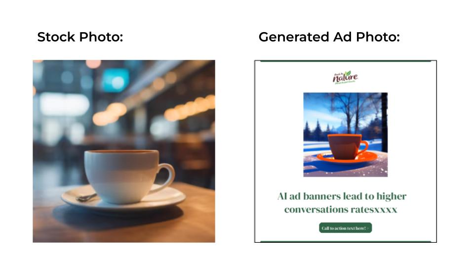

# stable-diffusion-api

This project aims to generate a new image in a similar style using the Stable Diffusion algorithm with a given stock photo and a prompt. Additionally, it creates a simple dynamic ad template using the generated image.

## Problem Solving

Traditional methods of creating advertisements can be time-consuming and costly. This project allows users to create unique ad visuals with a stock photo and a set of text inputs. The Stable Diffusion(Img2Img) algorithm stands out with its ability to produce realistic and creative images.

## Technologies Used

- Python: 3.10.12
- NVIDIA CUDA: 12.3
- Flask: Used to build the web application.
- PyTorch and Stable Diffusion(Img2Img): Utilized for image generation processes.
- HTML and CSS: Employed for creating web page templates.

## How to Use
1. Make sure you have a NVIDIA GPU with CUDA support.
2. Clone the project to your computer:
    `git clone https://github.com/user/stable-diffusion-api.git`
3. Navigate to the project directory:
    `cd stable-diffusion-api`
4. Create a virtual environment and install the libraries:
    `python -m venv venv`
    `source venv/bin/activate`
    `pip install -r requirements.txt`
5. Run the app:
    `python app.py`
6. Open your browser and go to http://localhost:5000.
7. Fill out the form on the web page to generate the ad.

- **Docker:** In Development
- **Google Cloud Platform:** In Development

## Example Usages
### Example 1: 
- **Generated Image:**
    - **Prompt:** "Starbucks coffee cup placed on marble tabletop in the rose garden, floral background, 8k, ultra realistic, realistic shadows, background color: "
    - **Hexcode:** `#FF0000`
- **Generated Ad:**
    - **Hexcode:** `#316346`
    - **Punchline:** "AI ad banners lead to higher conversations ratesxxxx"
    - **Button:** "Call to action text here! >"

### Example 2: 
- **Generated Image:**
    - **Prompt:** "Coffee cup placed on a glass tabletop in the winter resort, snowy background, 8k, ultra realistic, realistic shadows, cup color: "
    - **Hexcode:** `#FF6900`
- **Generated Ad:**
    - **Hexcode:** `#316346`
    - **Punchline:** "AI ad banners lead to higher conversations ratesxxxx"
    - **Button:** "Call to action text here! >"

